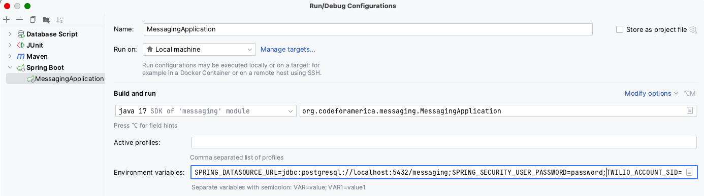

# Developer Guide

For simplicity, this guide will make some assumptions. If you need additional support getting set up,
reach out.
* MacOS
* IDEA IntelliJ IDE

## Running the app
1. Clone repository
    * URL: `https://github.com/codeforamerica/messaging.git`
2. Configure Java JDK
    * Version: 17
    * Distribution: [Eclipse Temurin](https://adoptium.net/temurin/releases/)
        * [Determine your mac's architecture](https://docs.cse.lehigh.edu/determine-mac-architecture/) before choosing a download
    * Ensure your Project Structure has the correct SDK chosen in case you have multiple versions downloaded
    * 
3. Setup PostgreSQL Databases
    * Unit tests are not run against an in-memory database, you will have to create one for the tests to use
        * Test database = `jdbc:postgresql://localhost:5432/messaging_test`
    * To run the application locally, you will need to create a second database
        * Local database = `jdbc:postgresql://localhost:5432/messaging`
    * The database in the deployed environment (i.e. Staging) can be tunneled into using Aptible credentials
4. Run all tests
    * Ensure you are using the `test` [spring profile](https://docs.spring.io/spring-boot/docs/1.2.0.M1/reference/html/boot-features-profiles.html)
    * [application-test.properties](src/main/resources/application-test.properties) sets the datasource url to `messaging_test`, in addition to other important settings
    * This project does not have version controlled run configurations to prevent mistakes in leaking credentials
    * Update junit and maven [run configuration templates](https://www.jetbrains.com/help/idea/run-debug-configuration.html#templates) to use the `test` profile so that they will pick up config changes automatically
5. Run `MessagingApplication.java`
    * Run this in whatever way you wish, you will have set all the environment variables listed in the [README](README.md#configuration) configuration table
    * Keep all of these keys safe by NEVER:
        * Checking them in to version control
        * Giving or receiving them via slack/email/any non-encrypted channel
        * Taking screenshots or pasting them into shared documents
    * Use LastPass to share secrets or pull them directly from the provider page
        * Alert someone if you are concerned any keys have been leaked so a rotation can be performed
        * Stolen messaging keys can result in costly misuse of our messaging platform
    * 
6. Test the API
    * Without Twilio or Mailgun credentials setup, you won't have much to test, so make sure those services are set up first
    * Basic auth is in place with the password being set in [application-test.properties](src/main/resources/application-test.properties)
        * This can be changed easily, but the default credentials are "user" / "password"
        * Make sure the basic auth credentials are set for every request
    * See the autogenerated API documentation once the app is running by going to {$BASE_URL}/public/docs/api/v1
        * e.g. https://app-54372.on-aptible.com/public/docs/api/swagger-ui/index.html or http://localhost:8080/public/docs/api/v1
    * Sending a message requires a template, so query the `templates` endpoint to get a list of usable templates
        * Your local instance will not have any templates, so you will need to manually add one to the database
        * See [V4_Add_template_seed_data_non_prod.sql](src/main/resources/db/migration/non-prod/V4_Add_template_seed_data_non_prod.sql) for examples
    * Then post an individual message to `messages` or a batch to `message_batches` using a csv
        * Consult the Swagger/OpenAPI docs to learn how to structure your requests
7. Configure callback URLs to see message statuses
    * See [ngrok](https://ngrok.com/) for a tool that will allow you to forward your localhost instance
        * Ngrok url can be set as the callback url with messaging providers to see message statuses
        * Other users can test the API using your instance with the ngrok url
    * Twilio
        * Integration > Callback URL: `<your ngrok address>/public/twilio_callbacks/status`
        * 
    * Mailgun
        * Webhooks > Test Webhook: `<your ngrok address>/public/mailgun_callbacks/status`
        * 

## Help! I'm getting a 'flyway'/'dataSource' error!
`Exception encountered during context initialization - cancelling refresh attempt: org.springframework.beans.factory.BeanCreationException: Error creating bean with name 'flyway' defined in class path resource [org/springframework/boot/autoconfigure/flyway/FlywayAutoConfiguration$FlywayConfiguration.class]: Failed to instantiate [org.flywaydb.core.Flyway]: Factory method 'flyway' threw exception with message: Error creating bean with name 'dataSource' defined in class path resource [org/springframework/boot/autoconfigure/jdbc/DataSourceConfiguration$Hikari.class]: Failed to instantiate [com.zaxxer.hikari.HikariDataSource]: Factory method 'dataSource' threw exception with message: Failed to determine a suitable driver class`

If you are seeing this error, either your database setup is incomplete or the spring datasource url
environment variable has not been correctly set for the process you are running.

To verify the database being used, look for this log. The database may not be set:

`o.f.c.i.database.base.BaseDatabaseType   : Database: jdbc:postgresql://localhost:5432/`...

To debug how the environment variable is being set:
1. Ensure the database exists and can be connected to
1. Check the spring profile being used
1. Check your run configurations
1. Explore all custom project settings for env vars that may exist and be interfering