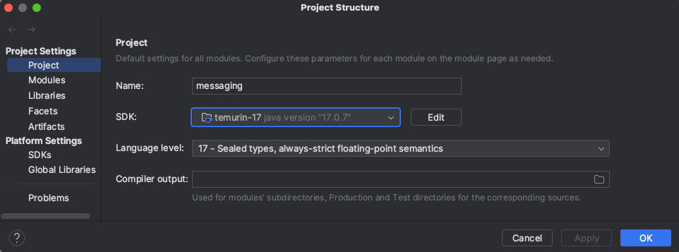
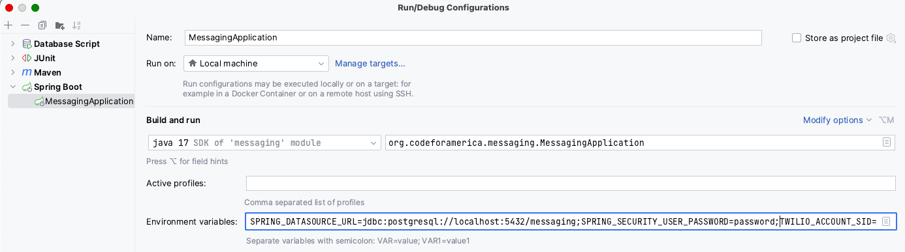

# Description
A messaging backend to provide a REST API for sending text messages and email.
It supports both transactional messages and bulk sending.

# Stack

#### Core tech
- Java JDK 17
- Spring Boot 3.x
    - Spring Data JPA
- PostgreSQL
- Flyway
- Maven
- Aptible

#### Integration
- SMS: Twilio
- Email: Mailgun
- (TBD) Salesforce/Mulesoft

#### Important Libraries
- JobRunr
- Lombok annotations
- Handlebars (Mustache)
- Apache Commons CSV

# Developer Setup

For simplicity, this guide will make some assumptions. If you need additional support getting set up, 
reach out.
* MacOS
* IDEA IntelliJ IDE

## Basic Steps
1. Clone repository
    * URL: `https://github.com/codeforamerica/messaging.git`
2. Configure Java JDK 
    * Version: 17
    * Distribution: [Eclipse Temurin](https://adoptium.net/temurin/releases/)
        * [Determine your mac's architecture](https://docs.cse.lehigh.edu/determine-mac-architecture/) before choosing a download 
    * Ensure your Project Structure has the correct SDK chosen in case you have multiple versions downloaded
    * 
3. Setup PostgreSQL Databases
    * Unit tests are not run against an in-memory database, you will have to create one for the tests to use
      * Test database = `jdbc:postgresql://localhost:5432/messaging_test`
    * To run the application locally, you will need to create a second database
      * Local database = `jdbc:postgresql://localhost:5432/messaging`
    * The database in the deployed environment (i.e. Staging) can be tunneled into using Aptible credentials
4. Run all tests
   * Ensure you are using the `test` [spring profile](https://docs.spring.io/spring-boot/docs/1.2.0.M1/reference/html/boot-features-profiles.html)
   * [application-test.properties](src/main/resources/application-test.properties) sets the datasource url to `messaging_test`, in addition to other important settings
   * Currently, this project does not have version controlled run configurations
   * We suggest altering all [run configuration templates](https://www.jetbrains.com/help/idea/run-debug-configuration.html#templates) to use the `test` profile so that they will pick up config changes automatically
5. Run the `MessagingApplication` locally
   * You will also have to set up this run configuration yourself
   * Set the spring profile to 'test'
   * Override the database url by setting `SPRING_DATASOURCE_URL=jdbc:postgresql://localhost:5432/messaging`
   * Any service providers you wish to integrate with will require the API keys to be set using accounts you have access to
     * Mailgun integration requires:
       * `MAILGUN_API_KEY`
         * If using a sandbox environment, remember to add test recipients to the allowed recipient list
     * Twilio integration requires:
       * `TWILIO_ACCOUNT_SID`
       * `TWILIO_AUTH_TOKEN`
       * `TWILIO_MESSAGING_SERVICE_SID`
     * Keep all of these keys safe by NEVER:
       * Checking them in to version control
       * Pasting them into slack/email/any non-encrypted channel
       * Taking screenshots or pasting them into any documents
       * Use LastPass to share secrets or pull them directly from the provider page
         * Alert someone if you are concerned any keys have been leaked so a rotation can be performed
         * Stolen messaging keys can result in costly misuse of our messaging platform
   * 
6. Test the API
    * Without Twilio or Mailgun credentials setup, you won't have much to test, so make sure those services are set up first
    * Basic auth is in place with the password being set in [application-test.properties](src/main/resources/application-test.properties)
      * This can be changed easily, but the default credentials are "user" / "password"
    * See the autogenerated API documentation once the app is running by going to {$BASE_URL}/docs/api/v1
      * e.g. https://app-54372.on-aptible.com/docs/api/swagger-ui/index.html or http://localhost:8080/docs/api/v1
    * Sending a message requires a template, so query the `templates` endpoint to get a list of usable templates
      * Your local instance will not have any templates, so you will need to manually add one to the database
      * See [V4_Add_template_seed_data_non_prod.sql](src/main/resources/db/migration/non-prod/V4_Add_template_seed_data_non_prod.sql) for examples
    * Then post an individual message to `messages` or a batch to `message_batches` using a csv
    * See [ngrok](https://ngrok.com/) for a tool that will allow you to forward your localhost instance
      * Ngrok url can be set as the callback url with messaging providers to see message statuses
      * Other users can test the API using your instance with the ngrok url

## Help! I'm getting a 'flyway'/'dataSource' error!
`Exception encountered during context initialization - cancelling refresh attempt: org.springframework.beans.factory.BeanCreationException: Error creating bean with name 'flyway' defined in class path resource [org/springframework/boot/autoconfigure/flyway/FlywayAutoConfiguration$FlywayConfiguration.class]: Failed to instantiate [org.flywaydb.core.Flyway]: Factory method 'flyway' threw exception with message: Error creating bean with name 'dataSource' defined in class path resource [org/springframework/boot/autoconfigure/jdbc/DataSourceConfiguration$Hikari.class]: Failed to instantiate [com.zaxxer.hikari.HikariDataSource]: Factory method 'dataSource' threw exception with message: Failed to determine a suitable driver class`

If you are seeing this error, either your database setup is incomplete or the spring datasource url
environment variable has not been correctly set for the process you are running.

To verify the database being used, look for this log. The database may not be set:

`o.f.c.i.database.base.BaseDatabaseType   : Database: jdbc:postgresql://localhost:5432/`...

To debug how the environment variable is being set:
1. Ensure the database exists and can be connected to
1. Check the spring profile being used
1. Check your run configurations
1. Explore all custom project settings for env vars that may exist and be interfering

# Configuration
## Secrets
All secrets are read from environment variables and kept out of version control. Configuration for 
secrets required for deployment can be found in the [deploy.yml](.github/workflows/deploy.yml) file, which use 
encrypted secret values stored at https://github.com/codeforamerica/messaging/settings/secrets/actions. 
Those with access can find the values needed in LastPass under the "Shared-Messaging Product" folder

## Non-secrets

All other configuration is maintained in conventional Spring Boot `application.properties` with 
`application-test` and `application-ci` variations.

## Code Style

Our code style is not strictly followed, but if you wuld like to apply the project defaults, open 
IntelliJ Settings/Preferences and go to `Editor > Code Style > Java` and next to "Scheme" hit the
cogwheel and `Import Scheme > IntelliJ IDEA code style XML` with
[CfaFlavoredGoogleStyle.xml](intellij-settings/CfaFlavoredGoogleStyle.xml)

# Documentation

We use [Springdoc-openapi](https://springdoc.org/v2), which helps automate the generation of API
documentation in Spring Boot projects. It works by examining an application at runtime to infer API
semantics based on spring configurations, class structure, and various annotations. Springdoc is a
better supported and more recently updated alternative to Springfox.

This project has configured a custom docs location in
[application.properties](src/main/resources/application.properties) and a Swagger UI can be found at
[BASE_URL/docs/api/v1](http://localhost:8080/docs/api/v1) wherever the app is running.

# Environments

| App               | Database             | Twilio Account | Twilio Messaging Service | Stack            | Environment            | Security                                                             |
|-------------------|----------------------|----------------|--------------------------|------------------|------------------------|----------------------------------------------------------------------| 
| messaging-staging | messaging-staging-db | CfA SNIL       | messaging-staging        | shared-us-west-1 | innovation-lab-staging | Use Basic Authentication with user="user" and password from LastPass |

# Deployment
- We use [Dockerfile Deploy](https://deploy-docs.aptible.com/docs/dockerfile-deploy)
- Configure your git remotes for staging and production, e.g., `git remote add aptible-staging git@beta.aptible.com:innovation-lab-staging/messaging-staging.git`.
- Deploy using git push: `git push aptible-staging main`
- Alternatively, use the github action to deploy a branch
